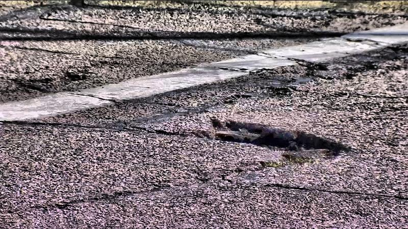
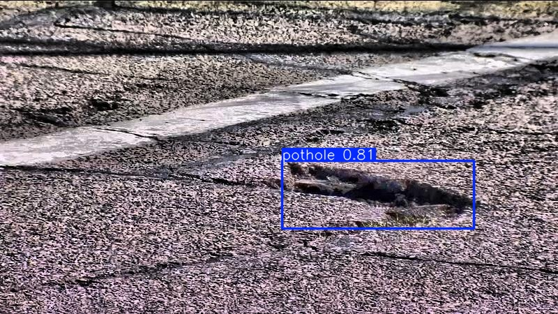

# 🚀 Pothole Detection with YOLOv11 
### 🏆 Real-time Pothole Detection Using YOLOv11 and OpenCV  
    

---

<div align="center">
  
</div>

---

## 🌟 About the Project  
This project implements a **YOLOv11-based pothole detection** system capable of processing both images and videos, along with real-time detection using OpenCV.  

✅ Real-time detection using YOLOv11 
✅ High accuracy with efficient inference  
✅ Training from scratch or using pre-trained weights  

---

## 🎯 Features  
✔️ State-of-the-art YOLOv11 model  
✔️ Fast processing with OpenCV  
✔️ Supports both image and video input  
✔️ Clean and modular code structure  
✔️ Jupyter notebook for experimentation  

```markdown
# 🚀 Pothole Detection using YOLOv8

## 📂 **Project Structure**  
```plaintext
pothole-detection-yolo11/
├── data/
│   ├── images/              # Raw images
│   ├── labels/              # YOLO-format labels
│   ├── data.yaml            # Dataset config
├── models/
│   ├── yolo11n.pt           # Pre-trained model
│   └── best.pt              # Trained model (after training)
├── src/
│   ├── train.py             # Training script
│   ├── detect.py            # Inference on images
│   ├── real_time.py         # Real-time detection script
├── notebooks/
│   └── experiment.ipynb     # Jupyter notebook for experimentation
├── requirements.txt         # Package dependencies
├── README.md                # Project documentation
```

---

## 🚀 **Installation**

### 1. **Clone the Repository**  
```bash
git clone https://github.com/NarottamSharma/PotHole.git
cd pothole-detection-yolo11  
```

### 2. **Create a Virtual Environment**  
```bash
python -m venv venv  
# Activate virtual environment  
source venv/bin/activate  # Linux/Mac  
venv\Scripts\activate     # Windows  
```

### 3. **Install Dependencies**  
```bash
pip install -r requirements.txt  
```

✅ **requirements.txt**:  
```text
ultralytics  
opencv-python  
torch  
numpy  
```

### 4. **Download YOLO Weights**  
Create a `models/` directory and place the weights file:  
```bash
mkdir -p models  
wget -O models/yolo11n.pt https://github.com/ultralytics/assets/releases/download/v8.0.0/yolov8n.pt  
```

---

## 🎯 **Usage**

### 👉 1. **Run Detection on an Image**  
Run inference on an image using `detect.py`:  
```bash
python src/detect.py --source data/images/sample.jpg  
```

### 👉 2. **Run Detection on a Video**  
Run inference on a video using `real_time.py`:  
```bash
python src/real_time.py --source data/videos/input.mp4 --output data/videos/output.mp4  
```

### 👉 3. **Train the Model**  
Train the model from scratch or fine-tune an existing model:  
```bash
python src/train.py --data data/data.yaml --epochs 100 --imgsz 640  
```

---

## 📂 **Dataset Configuration**
**data.yaml**  
Example dataset configuration file (`data/data.yaml`):  
```yaml
train: data/images/train/  
val: data/images/val/  
test: data/images/test/  

nc: 1  # Number of classes  
names: ['pothole']  
```

---

## 🏆 **Code Overview**

### 🔹 **Training Script (`src/train.py`)**  
Trains the YOLOv8 model on the custom dataset:  
```python
from ultralytics import YOLO

# Load YOLO model
model = YOLO('models/yolo11n.pt')

# Train the model
model.train(data='data/data.yaml', epochs=100, imgsz=640)
```

---

### 🔹 **Detection Script (`src/detect.py`)**  
Performs object detection on static images:  
```python
from ultralytics import YOLO
import cv2

model = YOLO('models/best.pt')

def detect_image(image_path):
    frame = cv2.imread(image_path)
    results = model.predict(frame, imgsz=640, conf=0.5)

    for r in results:
        for box in r.boxes:
            x1, y1, x2, y2 = box.xyxy[0]
            conf = box.conf[0]
            label = r.names[int(box.cls[0])]
            cv2.rectangle(frame, (int(x1), int(y1)), (int(x2), int(y2)), (0, 255, 0), 2)
            cv2.putText(frame, f"{label} {conf:.2f}", (int(x1), int(y1) - 10),
                        cv2.FONT_HERSHEY_SIMPLEX, 0.5, (0, 255, 0), 2)

    cv2.imshow('Detection', frame)
    cv2.waitKey(0)
```

---

### 🔹 **Real-time Detection (`src/real_time.py`)**  
Performs real-time object detection from a video stream:  
```python
from ultralytics import YOLO
import cv2

model = YOLO('models/best.pt')

cap = cv2.VideoCapture('data/videos/input.mp4')

while True:
    ret, frame = cap.read()
    if not ret:
        break
    
    results = model.predict(frame, imgsz=640, conf=0.5)
    
    for r in results:
        for box in r.boxes:
            x1, y1, x2, y2 = box.xyxy[0]
            conf = box.conf[0]
            label = r.names[int(box.cls[0])]
            color = (0, 255, 0)
            cv2.rectangle(frame, (int(x1), int(y1)), (int(x2), int(y2)), color, 2)
            cv2.putText(frame, f"{label} {conf:.2f}", (int(x1), int(y1) - 10),
                        cv2.FONT_HERSHEY_SIMPLEX, 0.5, color, 2)
    
    cv2.imshow('Real-Time Detection', frame)
    if cv2.waitKey(1) & 0xFF == ord('q'):
        break

cap.release()
cv2.destroyAllWindows()
```

---

## 🖼️ **Sample Outputs**
| Input Frame | Detected Output |
|------------|-----------------|
|  |  |

---

## 🛡️ **Best Practices**
✅ Use a GPU for faster training and inference  
✅ Adjust the confidence threshold for optimal performance  
✅ Keep the dataset balanced for better accuracy  

---

## 🤝 **Contributing**
Contributions are welcome! If you encounter issues, feel free to open an issue or a pull request.

---

## 📝 **License**
This project is licensed under the [MIT License](LICENSE).  
```

